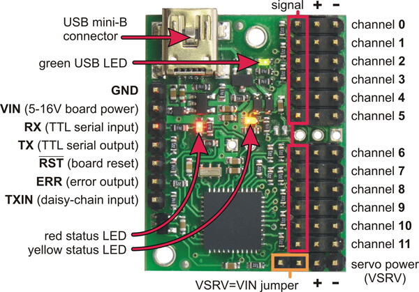

# Athena Robot Dog
### By Matthew Thomas Beck (https://www.linkedin.com/in/matthewthomasbeck/)

Special thanks to Aaed Musa (https://www.linkedin.com/in/aaedmusa/) and Omar Ferrer (https://www.linkedin.com/in/omar-ferrer-0bb6355a/) for their help

The story behind the build: https://www.matthewthomasbeck.com/pages/Athena.html

Please consider: if you like it, **star it!**

## Tech Stack:
- Language: *Python*
- Libraries: *threading, queue, time, os, socket, logging, collections.deque, subprocess, signal, sys, random, numpy, opencv-python, openvino, smbus, RPi.GPIO, pigpio, pyserial*
- Toolkits: *OpenVino*

## **(WIP)** Build For Yourself!
### Please carefully read every step before proceeding; robots get very expensive, very quickly

1. **(WIP)** Put together an Edge AI Module, instructions and part list found here: https://github.com/matthewthomasbeck/Edge_AI_Module

2. Asemble Aaed Musa's 'Ares' and buy hardware components like screws (**IMPORTANT!** do NOT buy the servos listed here): https://www.instructables.com/3D-Printed-Robot-Dog/

3. Purchase x12 45kg 8.4V servos: https://www.amazon.com/ANNIMOS-Coreless-Steering-Stainless-Waterproof/dp/B0C69BXL6V/ref=sr_1_1_sspa?crid=2CZYTFNIBMZB5&dib=eyJ2IjoiMSJ9.VzTVL5Lop0_Yo7Rclx1P0kO2cp7ohwbDt7B7rXalG4MsVGLa0FryPlcn-SrE6rDy0qo-lTfH70VDVMsDM-jQDLI-_-WiCpWL-WSlHzyH4CQCISmqboxoTY8Y-ynt7SQqmFj8ZRk0Gt9Filc5FiNrXsSKQOzpLyP5GSNfhjMawo2jog92e5XEfgTXn7Z0gk2yIjBBVJ0yKB6Lx0ZyPcQ3M63q5b7Jplu8NwipFpI1uh-We4zfnRz7NO6QHMuQK18hUQgB-gn_UIU28R_rg6OCoAk3JSbtqz0F4uTjACbcWkg.KrSoIdIEi_MDbt4yBtMP7t1w8LMzUjnk7HNWLFUnKj0&dib_tag=se&keywords=45kg%2Bservos&qid=1758412280&sprefix=45kg%2Bservo%2Caps%2C184&sr=8-1-spons&sp_csd=d2lkZ2V0TmFtZT1zcF9hdGY&th=1

4. Print out my custom parts and replace their respective Ares counterparts

5. Place the Edge AI Module into the robot; run the antenna through the antenna hole and wire the servos as follows:

| **Joint Servo** | **Maestro Channel** |
| ----------- | ----------- |
| **Front Left Leg** |  |
| hip servo | *channel 3* |
| femur servo | *channel 5* |
| tibia servo | *channel 4* |
| **Front Right Leg** |  |
| hip servo | *channel 2* |
| femur servo | *channel 1* |
| tibia servo | *channel 0* |
| **Back Left Leg** |  |
| hip servo | *channel 9* |
| femur servo | *channel 7* |
| tibia servo | *channel 6* |
| **Back Right Leg** |  |
| hip servo | *channel 11* |
| femur servo | *channel 10* |
| tibia servo | *channel 9* |

5. **(WIP)** Wait for me to upload a comprehensive model (it takes time to train, on top of this being a first for me)